# OpenVINO GPU Plugin MoE Implementation Details

This document explains the internal mechanism of how the OpenVINO Intel GPU plugin (`intel_gpu`, formerly clDNN) handles Mixture of Experts (MoE) models, specifically focusing on the GPT-OSS-20B architecture.

## 1. Overview: Graph Fusion Strategy

OpenVINO does not typically execute the raw, decomposed operations of an MoE block (Softmax -> TopK -> Gather -> MatMul -> Scatter) individually on the GPU. Instead, it relies on a **Graph Fusion** strategy.

*   **Transformation Pass**: A specific transformation pass named `ConvertMOEToMOECompressed` scans the model graph.
*   **Pattern Matching**: It looks for a specific subgraph pattern that represents an MoE block.
*   **Replacement**: If the pattern is matched, the entire subgraph is replaced by a single, monolithic internal operation called `MOECompressed`.

### Why Injection Fails
This mechanism explains why injecting "dump nodes" (like `ops.convert` or `ops.result`) into the graph (e.g., between Softmax and TopK) causes execution failures on GPU. The injection breaks the strict pattern matching required by `ConvertMOEToMOECompressed`. Since the GPU plugin does not have a fallback implementation for the generic `MOE` op (only the fused `MOECompressed`), the graph compilation fails or falls back to an unsupported state.

## 2. The Transformation Pass

**File**: `src/plugins/intel_gpu/src/plugin/transformations/convert_moe_to_compressed.cpp`

The transformation defines specific patterns to match. For GPT-OSS-20B, it looks for the `GEMM2_BIAS_SWIGLU_CLAMP` pattern, which generally includes:
1.  **Routing**: `Softmax` -> `TopK` -> `Convert` (indices).
2.  **Weights**: Compressed weights (u4/u8) with scales and zero-points, often involving `Convert`, `Subtract`, and `Multiply` nodes.
3.  **Structure**: The specific flow of data from the input through the router to the experts.

Once matched, these nodes are fused into `ov::intel_gpu::op::MOECompressed`.

## 3. Internal Execution Pipeline

During the program build phase (`src/plugins/intel_gpu/src/plugin/ops/moe.cpp`), the `MOECompressed` op is expanded into a sequence of specialized GPU primitives.

### Step 1: Mask Generation (`moe_mask_gen`)
*   **Input**: TopK indices from the router.
*   **Function**: Analyzes the routing decisions for the entire batch. It calculates:
    *   Which experts are active.
    *   How many tokens are assigned to each expert.
    *   A mapping of `(token_index, expert_index)`.

### Step 2: Input Gathering (`moe_gather`)
*   **Input**: Original Hidden States, Mask Generation outputs.
*   **Function**: This answers **"How to pass the input to the expert?"**.
    *   It physically copies and reorders the tokens.
    *   Tokens assigned to the same expert are grouped together into a continuous memory block.
    *   *Example*: If Token 0 and Token 5 go to Expert A, they are placed side-by-side in the gathered buffer.

### Step 3: Expert Execution (`moe_gemm`)
*   **Input**: Gathered Inputs, All Expert Weights.
*   **Function**: This answers **"How to load expert weights?"**.
    *   **Weight Loading**: All expert weights are loaded into GPU memory as a single large tensor (or set of tensors).
    *   **Execution**: The kernel iterates through the active experts. For each expert, it uses the `EXPERTS_ID` list to calculate the offset in the weight tensor.
    *   It performs the matrix multiplication (GEMM) for that expert's batch of tokens.
    *   For GPT-OSS-20B, this happens in two stages:
        1.  **Up Projection**: Projects inputs to the intermediate size.
        2.  **Down Projection**: Projects results back to the hidden size.

### Step 4: Activation (`swiglu`)
*   **Function**: Applies the SwiGLU activation function (and potentially clamping) on the output of the Up Projection.

### Step 5: Scatter Reduction (`moe_scatter_reduce`)
*   **Input**: Expert outputs, Routing Weights (Softmax probabilities).
*   **Function**:
    *   Multiplies the expert outputs by their corresponding routing weights.
    *   Sums the results if a token was routed to multiple experts.
    *   Writes the final result back to the original token position in the sequence.

## 4. Interaction Diagram

The following diagram illustrates the transformation and execution flow described above.

```mermaid
flowchart TD
    subgraph "1. Graph Compilation Phase"
        Original["Original Subgraph: Softmax -> TopK -> Gather -> MOE"]
        Pass["Transformation Pass: ConvertMOEToMOECompressed"]
        Fused["Fused Op: MOECompressed"]
        
        Original -->|Pattern Match| Pass
        Pass -->|Replace| Fused
    end

    subgraph "2. GPU Execution Pipeline (Primitives)"
        %% Data Nodes
        Input_Hidden["Input Hidden States"]
        Input_TopK["TopK Indices"]
        Input_RouterW["Router Weights"]
        Input_ExpertW["All Expert Weights - Single Tensor"]

        %% Operation Nodes
        Op_MaskGen["moe_mask_gen"]
        Op_Gather["moe_gather"]
        Op_GemmUp["moe_gemm - Up Projection"]
        Op_Swiglu["swiglu"]
        Op_GemmDown["moe_gemm - Down Projection"]
        Op_Scatter["moe_scatter_reduce"]

        %% Flow
        Input_TopK --> Op_MaskGen
        
        Op_MaskGen -->|Expert IDs and Token Counts| Op_Gather
        Input_Hidden --> Op_Gather
        
        Op_Gather -->|Gathered Tokens - Contiguous Memory| Op_GemmUp
        Input_ExpertW -->|Indexed by Expert ID| Op_GemmUp
        Op_MaskGen -->|Expert IDs| Op_GemmUp
        
        Op_GemmUp --> Op_Swiglu
        Op_Swiglu --> Op_GemmDown
        
        Input_ExpertW -->|Indexed by Expert ID| Op_GemmDown
        Op_MaskGen -->|Expert IDs| Op_GemmDown
        
        Op_GemmDown --> Op_Scatter
        Input_RouterW --> Op_Scatter
        Op_MaskGen -->|Reorder Mapping| Op_Scatter
        
        Op_Scatter --> Output[Final Output]
    end
```

## 5. Summary of Key Mechanisms

| Concept | Implementation Detail |
| :--- | :--- |
| **Weight Loading** | Weights are **not** dynamically loaded per token. They reside in memory as a large tensor. The kernel uses `EXPERTS_ID` to *index* into this tensor during execution. |
| **Input Routing** | Inputs are **gathered** (`moe_gather`) into contiguous blocks per expert before computation, ensuring efficient memory access for the GEMM kernels. |
| **Debugging** | Modifying the graph structure breaks fusion. To debug, use non-invasive methods like `ov::Model::add_outputs` to extract intermediate values without altering the graph topology significantly enough to break the pattern matcher (though even this can sometimes be tricky depending on where the output is added). |
